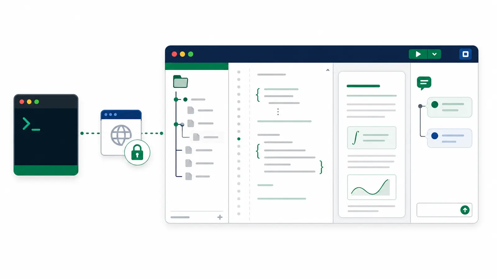

# Overleaf Web MCP

Let Claude, Cursor, or any [Model Context Protocol](https://modelcontextprotocol.io) client read,
edit, compile, and review your Overleaf projects, signed in as you.

Overleaf Web MCP is an unofficial server that signs in to Overleaf once through a browser window
you control, then lets an AI assistant work on your projects the way you would in the web editor.
It uses the same browser-facing endpoints the Overleaf editor uses, so it needs no Git
integration and no premium plan for the core workflow.

!!! danger "Unofficial client of private APIs"
    Overleaf may change these interfaces without notice, and automating `www.overleaf.com` may
    carry Terms-of-Service and account risk. Start with a disposable project, keep request volume
    low, and review Overleaf's current terms before using an account you care about.

## What you can say

Once connected, you talk to your assistant in plain language. The assistant picks the tools.

- "List my Overleaf projects and open the one called *CHEERSafe*."
- "Rewrite the introduction of `main.tex` for a general audience, as a tracked change."
- "Compile the paper and tell me whether it built."
- "Which figures in `./figures` differ from what's in the project? Upload only those."
- "Summarize the open review comments and reply to the one about Table 2."

## What it can do

**Browse and organize.** List projects, read the file tree with the configured root document and
compiler, create folders and files, rename, move, upload, download, and delete with confirmation.

**Write safely.** Replace a whole document or a single section. Every edit is checked against the
revision you read first, so a collaborator's concurrent change is reported instead of overwritten.
Edits can be recorded as Overleaf tracked changes.

**Work by section.** Parse `\section` headings in a file, read one section, and replace one section.

**Compile.** Build the project's configured root document, or any document you name, and stop a
running compile.

**Review.** List comment threads with their locations, reply, add a comment anchored to exact
text, and resolve or reopen threads.

**Follow history.** Poll recent project history with a version cursor to see who changed what.

## How it keeps your project safe

- Text edits require the revision from a prior read and fail with a conflict if the document
  changed underneath.
- Tracked changes are opt-in and never silently downgraded to plain edits.
- Deletes require the path to be confirmed; downloads never overwrite a local file unless asked.
- A write that times out is observed, never resubmitted, so nothing is applied twice.
- Your session cookie stays on your machine in a file only you can read, and is never returned by
  any tool.

Details are in the [safety model](safety.md).

## Next steps

- [Install](install.md) the server and connect your client.
- See [example prompts and workflows](using.md).
- Look up any tool in the [reference](tools.md).
